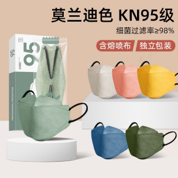

# EX 小兔鲜儿案例：课堂笔记

> 本章目标：把 HTML 结构、CSS 选择器、盒子模型、布局和组件样式组合成一个完整首页，建立“项目化写页面”的思路。

## 章节文件索引

- [index.html](./index.html)：首页结构。
- [Css/base.css](./Css/base.css)：基础公共样式。
- [Css/index.css](./Css/index.css)：首页业务样式。
- `assets/images/`：Logo、二维码等固定图片。
- `assets/uploads/`：商品、Banner、专题等页面素材。
- `assets/iconfont/`：字体图标资源。

## 1. 案例训练重点

小兔鲜儿案例是综合页面练习，重点不只是某个属性，而是如何把页面拆成模块：

- 顶部快捷导航。
- 主导航和 Logo。
- Banner 区域。
- 新鲜好物、人气推荐、商品分类。
- 最新专题。
- 页脚和服务信息。

这类页面接近真实电商首页，适合练习布局、间距、卡片、图片、图标和公共类。

## 2. 文件组织

推荐理解方式：

```text
EX（小兔鲜儿案例）/
  index.html
  Css/
    base.css
    index.css
  assets/
    images/
    uploads/
    iconfont/
```

职责划分：

| 文件 | 作用 |
| --- | --- |
| `index.html` | 页面结构和内容 |
| `base.css` | 初始化、公共类、基础样式 |
| `index.css` | 当前首页的模块样式 |
| `assets` | 图片、图标、静态资源 |

工程里把公共样式和页面样式分开很重要，后续页面变多时更容易维护。

## 3. 页面结构思路

首页可以按模块拆：

```html
<header>顶部区域</header>
<nav>导航区域</nav>
<main>
  <section>Banner</section>
  <section>新鲜好物</section>
  <section>人气推荐</section>
  <section>商品分类</section>
  <section>最新专题</section>
</main>
<footer>页脚</footer>
```

实际开发时，先画结构，再写 HTML，最后写 CSS。不要一边写样式一边随意改结构，否则容易混乱。

## 4. 公共版心

电商页面常见固定宽度版心：

```css
.wrapper {
  width: 1240px;
  margin: 0 auto;
}
```

作用：

- 保持页面主体内容居中。
- 多个模块共用同一个内容宽度。
- 方便统一对齐。

工程提醒：固定版心适合 PC 页面；移动端或响应式页面需要配合媒体查询、百分比、Flex/Grid 等方式。

## 5. 初始化和基础样式

常见初始化：

```css
* {
  margin: 0;
  padding: 0;
  box-sizing: border-box;
}

li {
  list-style: none;
}

a {
  text-decoration: none;
  color: inherit;
}

img {
  display: block;
}
```

为什么 `img` 常设为 `display: block`：

- 图片默认是行内替换元素。
- 底部可能出现基线空白缝隙。
- 设为块级后更方便控制布局。

## 6. 导航布局

导航常见结构：

```html
<ul class="nav-list">
  <li><a href="#">首页</a></li>
  <li><a href="#">生鲜</a></li>
</ul>
```

CSS 常用：

```css
.nav-list {
  display: flex;
  gap: 32px;
}
```

导航适合用列表，因为它本质上是一组链接。真实项目中，当前页面或 hover 状态通常会有高亮样式。

## 7. 商品卡片

商品卡片一般由图片、标题、描述、价格组成：

```html
<a class="goods-card" href="#">
  
  <h3>商品名称</h3>
  <p>商品描述</p>
  <span>￥99</span>
</a>
```

常见样式点：

- 图片统一尺寸，避免卡片高低不齐。
- 标题做单行或多行省略。
- 价格用醒目颜色。
- hover 时卡片上浮或加阴影。

## 8. 布局复用

页面里会出现多组类似结构，例如“新鲜好物”“人气推荐”“商品分类”。建议提取共性：

- 模块标题区域：标题 + 副标题 + 更多链接。
- 卡片列表：统一的网格或 Flex 排列。
- 商品卡片：图片 + 文本 + 价格。

学习阶段可以先写出来；复盘时要思考哪些样式可以复用。

## 9. 字体图标和图片资源

案例中包含 iconfont 资源，常用于：

- 搜索图标。
- 箭头。
- 服务图标。
- 社交或二维码相关图标。

图片资源分类：

- `images`：Logo、二维码等基础资源。
- `uploads`：业务内容图片，如商品图、专题图、Banner。

工程实践中，资源命名要稳定、语义清晰，避免 `1.png`、`2.png` 无法辨认。

## 10. CSS 命名建议

好的类名应该让人能看懂模块含义：

```css
.header {}
.shortcut {}
.nav {}
.banner {}
.goods-list {}
.goods-card {}
.footer {}
```

不建议大量使用：

```css
.box1 {}
.left1 {}
.red {}
```

除非是工具类，否则类名最好描述结构或业务含义。

## 易错点

- 图片路径要相对当前 HTML 或 CSS 文件判断，CSS 中的 `url()` 相对 CSS 文件。
- 导航列表不要只用一堆 `a` 堆在一起，建议使用 `ul > li > a`。
- 卡片列表中图片尺寸不统一，会导致页面视觉不齐。
- 公共类和页面类混在一起太多，后期不方便维护。
- `a` 包裹卡片时，要注意里面不要嵌套交互冲突的复杂控件。
- 页面中重复的间距、颜色、字号应该尽量保持一致。

## 工程实践补充

- 真实项目中通常会有设计稿，写 CSS 时要对齐设计稿的间距、字号、颜色和状态。
- 可以把颜色、字号、间距整理为设计变量，后续学习 CSS 变量时会更方便。
- 页面越复杂，越要先分模块，再写结构和样式。
- 首页性能要关注图片体积，商品图和 Banner 图通常需要压缩。
- 电商页常有响应式需求，固定宽度 PC 页面之后可以继续练习移动端适配。

## 本章复习清单

- 能说出 `base.css` 和 `index.css` 的职责区别。
- 能把首页拆成多个页面模块。
- 能写公共版心 `.wrapper`。
- 能用 Flex 或 Grid 排列商品卡片。
- 能处理图片底部空白缝隙。
- 能判断哪些样式适合抽成公共类。

