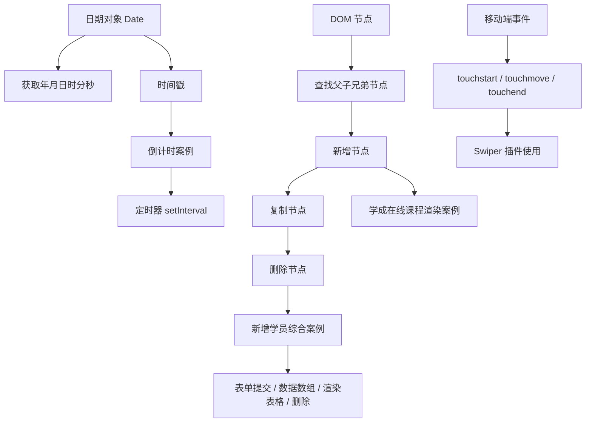
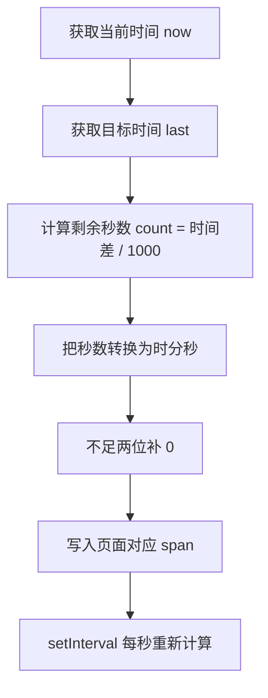
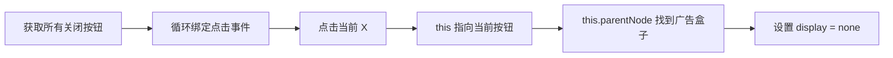
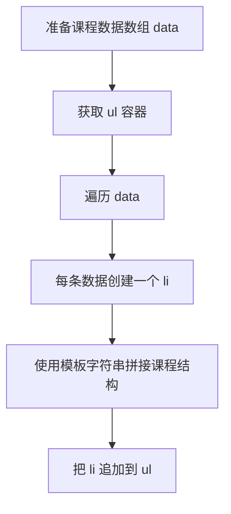
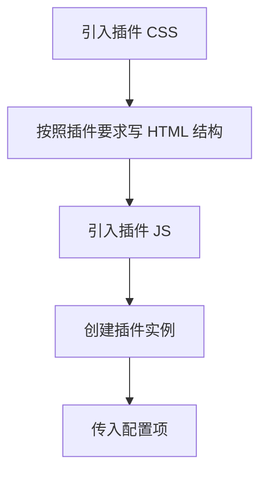
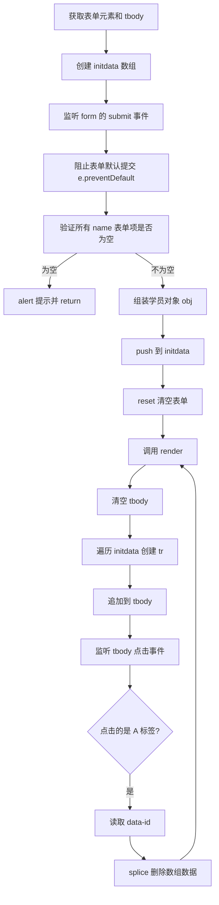

# JavaScript API 第四天知识点总结

> 本文按当前章节文件整理：日期对象、时间戳、倒计时案例、DOM 节点操作、移动端事件、Swiper 插件使用、动态渲染课程列表、新增学员综合案例。
>
> 总结范围：排除 `7. Swiper插件/` 中的插件源码文件，排除 `综合案例（新增学员）/index.css`，只总结学习页面和业务逻辑。

## 一、本章知识路线



## 二、`1. 日期对象实例化.html`

### 核心知识点

- `new Date()`：获取当前日期时间。
- `new Date('指定时间')`：创建指定时间的日期对象。
- `getFullYear()`：获取四位年份。
- `getMonth()`：获取月份，范围是 `0-11`，所以实际月份需要 `+ 1`。
- `getDate()`：获取日期，范围是 `1-31`。
- `getDay()`：获取星期，范围是 `0-6`，`0` 表示星期日。
- `getHours()`、`getMinutes()`、`getSeconds()`：获取时、分、秒。
- `setInterval()`：每隔指定时间重复执行函数。

### 重点代码

```js
function getTime() {
  const date = new Date()
  let y = date.getFullYear()
  let m = date.getMonth() + 1
  let d = date.getDate()
  let h = date.getHours()
  let min = date.getMinutes()
  let s = date.getSeconds()

  m = m < 10 ? '0' + m : m
  h = h < 10 ? '0' + h : h
  min = min < 10 ? '0' + min : min
  s = s < 10 ? '0' + s : s

  return `当前时间为${y}年${m}月${d}日${h}时${min}分${s}秒`
}

setInterval(function () {
  timespan.innerHTML = getTime()
}, 1000)
```

### 学习重点

这个文件的重点不是单纯获取时间，而是把“获取时间 → 格式化时间 → 渲染到页面 → 定时更新”串起来。实际开发中，时间展示通常都需要补零处理，否则会出现 `9:3:5` 这种不美观的格式。

## 三、`2. 时间戳的使用.html`

### 核心知识点

时间戳表示从 `1970-01-01 00:00:00` 到某个时间点经过的毫秒数。它适合做时间差计算，例如倒计时、过期判断、排序等。

常见获取方式：

```js
const date = new Date()
const timestamp1 = date.getTime()

const timestamp2 = +new Date()

const timestamp3 = Date.now()
```

### 三种方式区别

- `date.getTime()`：需要先创建日期对象。
- `+new Date()`：利用一元 `+` 把日期对象转为数字，写法简洁。
- `Date.now()`：直接获取当前时间戳，不能直接传入指定日期。

如果要获取指定日期的时间戳，可以使用：

```js
const timestamp = +new Date('2026-05-25 10:00:00')
```

## 四、`2. X(案例)倒计时.html`

### 案例目标

实现一个下班倒计时：页面显示剩余的时、分、秒，并且每秒自动刷新。

### 实现思路



### 重点代码

```js
function getCountTime() {
  const now = new Date()
  const last = new Date('2026-5-26 18:30:00')
  const count = (last - now) / 1000

  let h = parseInt(count / 60 / 60 % 24)
  h = h < 10 ? '0' + h : h

  let m = parseInt(count / 60 % 60)
  m = m < 10 ? '0' + m : m

  let s = parseInt(count % 60)
  s = s < 10 ? '0' + s : s

  document.querySelector('#hour').innerHTML = h
  document.querySelector('#minutes').innerHTML = m
  document.querySelector('#scond').innerHTML = s
}

getCountTime()
setInterval(getCountTime, 1000)
```

### 注意点

- 日期对象可以直接相减，结果是毫秒差。
- 倒计时通常要先调用一次函数，再开启定时器，否则页面会等 1 秒才更新。
- 代码中 `#scond` 应该是 `second` 的拼写，但只要 HTML 和 JS 选择器一致，功能仍能运行。

### 额外练习：随机背景色

文件里还封装了随机颜色函数：

```js
function getRandomColor(flag = true) {
  if (flag) {
    let str = '#'
    let arr = ['0', '1', '2', '3', '4', '5', '6', '7', '8', '9', 'a', 'b', 'c', 'd', 'e', 'f']
    for (let i = 1; i <= 6; i++) {
      let random = Math.floor(Math.random() * arr.length)
      str += arr[random]
    }
    return str
  } else {
    let r = Math.floor(Math.random() * 256)
    let g = Math.floor(Math.random() * 256)
    let b = Math.floor(Math.random() * 256)
    return `rgb(${r},${g},${b})`
  }
}
```

它练习了函数参数默认值、随机数、数组取值、字符串拼接和模板字符串。

## 五、`3. DOM节点.html`

### 核心知识点

DOM 树中的内容都可以看作节点：

- 元素节点：`div`、`span`、`p`、`a`、`img` 等。
- 属性节点：`id`、`class`、`src`、`href` 等。
- 文本节点：标签中的文字。
- 注释节点：HTML 注释。

### 节点关系查找

```js
const baby = document.querySelector('.baby')
console.log(baby.parentNode)
console.log(baby.parentNode.parentNode)
```

父节点查找使用 `parentNode`。

```js
const ul = document.querySelector('ul')
console.log(ul.children)
```

子元素查找常用 `children`，它只获取元素子节点，返回伪数组。

```js
const li2 = document.querySelector('ul li:nth-child(2)')
console.log(li2.previousElementSibling)
console.log(li2.nextElementSibling)
```

兄弟元素查找常用：

- `previousElementSibling`：上一个兄弟元素。
- `nextElementSibling`：下一个兄弟元素。

### 广告关闭案例

```js
const closeBtn = document.querySelectorAll('.box1')
for (let i = 0; i < closeBtn.length; i++) {
  closeBtn[i].addEventListener('click', function () {
    this.parentNode.style.display = 'none'
  })
}
```

案例思路：



这里的重点是 `this.parentNode`，通过当前点击按钮找到它所在的广告盒子，而不是写死某一个元素。

## 六、`4. 增加节点.html`

### 核心知识点

新增 DOM 节点分为三步：

1. 创建节点。
2. 设置节点内容。
3. 把节点插入页面。

### 重点代码

```js
const li = document.createElement('li')
const ul = document.querySelector('ul')

li.innerHTML = '新增的节点'
ul.appendChild(li)
ul.insertBefore(li, ul.children[0])
```

### 方法说明

- `document.createElement('li')`：创建一个新的元素节点。
- `appendChild(节点)`：追加到父元素最后。
- `insertBefore(新节点, 参考节点)`：插入到参考节点前面。

注意：同一个 DOM 节点不能同时出现在两个位置。上面代码先追加到末尾，再插入到第一个子元素前面，本质上是把同一个 `li` 移动到了新的位置。

## 七、`5. 复制+删除节点.html`

### 复制节点

```js
const ul = document.querySelector('ul')
const li1 = ul.children[0].cloneNode(true)
ul.appendChild(li1)
```

`cloneNode()` 用来克隆节点：

- `cloneNode(true)`：克隆当前节点以及里面的子节点和内容。
- `cloneNode(false)`：只克隆标签本身，不克隆里面的内容。
- 不写参数时，默认类似 `false`。

### 删除节点

```js
ul.removeChild(ul.children[5])
```

删除节点需要通过父元素操作：`父元素.removeChild(要删除的子元素)`。

### 学习重点

复制、增加、删除节点是动态页面的基础能力。后面的“课程列表渲染”和“新增学员”案例，本质上都是围绕数据创建节点、更新节点和删除节点。

## 八、`4.X （案例）学成在线首页.html`

### 案例目标

根据课程数据数组，动态生成课程卡片列表。

### 数据驱动页面

```js
let data = [
  {
    src: '../assets/course01.png',
    title: 'Think PHP 5.0 博客系统实战项目演练',
    num: 1125
  }
]
```

页面结构不是手动写死多个 `li`，而是通过数组循环生成。

### 重点代码

```js
const ul = document.querySelector('.box-bd ul')

for (let i = 0; i < data.length; i++) {
  const li = document.createElement('li')
  ul.appendChild(li)
  li.innerHTML = `
    <a href="#">
      
      <h4>${data[i].title}</h4>
      <div class="info">
        <span>高级</span> • <span>${data[i].num}</span>人在学习
      </div>
    </a>`
}
```

### 案例思路



### 关键理解

这就是“数据驱动视图”的雏形：数据变成什么样，页面就渲染成什么样。以后学习 Vue、React 时，也会不断遇到这个思想。

## 九、`6. M端事件.html`

### 核心知识点

移动端常见触屏事件：

```js
const div = document.querySelector('div')

div.addEventListener('touchstart', function () {
  console.log('开始摸')
})

div.addEventListener('touchmove', function () {
  console.log('移动摸')
})

div.addEventListener('touchend', function () {
  console.log('结束摸')
})
```

### 事件说明

- `touchstart`：手指触摸屏幕时触发。
- `touchmove`：手指在屏幕上移动时触发。
- `touchend`：手指离开屏幕时触发。

这类事件主要用于移动端交互，比如滑动轮播、拖拽、侧滑菜单等。

## 十、`7. js插件(M端).html`

### 核心知识点

这个文件演示了如何使用第三方移动端插件 Swiper。

使用插件的一般步骤：



### 页面结构

```html
<div class="swiper mySwiper">
  <div class="swiper-wrapper">
    <div class="swiper-slide">Slide 1</div>
    <div class="swiper-slide">Slide 2</div>
  </div>
  <div class="swiper-pagination"></div>
</div>
```

### 初始化代码

```js
var swiper = new Swiper(".mySwiper", {
  pagination: {
    el: ".swiper-pagination",
  },
  autoplay: {
    delay: 3000,
    stopOnLastSlide: false,
  }
})
```

### 学习重点

插件不是直接“自动生效”的，通常需要：

- 引入对应 CSS。
- 引入对应 JS。
- 保持插件要求的 HTML 类名和层级。
- 通过 `new 插件名()` 初始化。
- 根据文档传入配置项。

## 十一、`综合案例（新增学员）/综合案例.(新增学员).html`

### 案例目标

实现一个新增学员表格：

- 用户填写表单。
- 点击录入后，把表单数据保存到数组。
- 根据数组重新渲染表格。
- 点击删除后，从数组中删除对应数据，并重新渲染。

### 整体逻辑图



### 表单提交与阻止默认行为

```js
const info = document.querySelector('.info')

info.addEventListener('submit', function (e) {
  e.preventDefault()
})
```

表单中的按钮默认是 `submit` 类型，点击后页面会刷新。使用 `e.preventDefault()` 可以阻止默认提交，改为自己用 JS 控制数据。

### 非空验证

```js
const item = document.querySelectorAll('[name]')

for (let i = 0; i < item.length; i++) {
  if (item[i].value === '') {
    alert('输入内容不能为空')
    return
  }
}
```

这里通过属性选择器 `[name]` 一次性获取所有带 `name` 的表单项，统一做非空判断。

### 新增数据

```js
const obj = {
  stuId: initdata.length + 1,
  userName: userName.value,
  userAge: userAge.value,
  userGender: userGender.value,
  userSalary: userSalary.value,
  userCity: userCity.value
}

initdata.push(obj)
this.reset()
render()
```

新增不是直接写死到页面，而是先添加到 `initdata` 数组，再由 `render()` 统一渲染页面。

### 渲染函数

```js
function render() {
  tb.innerHTML = ''

  for (let i = 0; i < initdata.length; i++) {
    const tr = document.createElement('tr')
    tr.innerHTML = `
      <td>${initdata[i].stuId}</td>
      <td>${initdata[i].userName}</td>
      <td>${initdata[i].userAge}</td>
      <td>${initdata[i].userGender}</td>
      <td>${initdata[i].userSalary}</td>
      <td>${initdata[i].userCity}</td>
      <td>
        <a href="javascript:" data-id=${i}>删除</a>
      </td>`

    tb.appendChild(tr)
  }
}
```

渲染函数的关键是：每次先清空 `tbody`，再根据最新数组重新生成页面。

### 删除数据和事件委托

```js
tb.addEventListener('click', function (e) {
  if (e.target.tagName === "A") {
    e.preventDefault()
    initdata.splice(+e.target.dataset.id, 1)
    render()
  }
})
```

这里使用了事件委托：不是给每一个删除按钮单独绑定事件，而是把点击事件绑定给 `tbody`，再判断真正点击的目标是不是 `A` 标签。

### 关键理解

这个案例已经具备一个小型 CRUD 的雏形：

- `Create`：提交表单，新增学员。
- `Read`：通过 `render()` 读取数组并渲染表格。
- `Delete`：点击删除，移除数组数据。
- `Update`：本案例暂未实现，但可以在此基础上扩展编辑功能。

## 十二、本章高频方法速查

| 类型 | 方法 / 属性 | 作用 |
| --- | --- | --- |
| 日期 | `new Date()` | 创建当前时间对象 |
| 日期 | `getFullYear()` | 获取年份 |
| 日期 | `getMonth()` | 获取月份，结果为 `0-11` |
| 日期 | `getDate()` | 获取日期 |
| 日期 | `getHours()` | 获取小时 |
| 时间戳 | `getTime()` | 获取时间戳 |
| 时间戳 | `+new Date()` | 快速转时间戳 |
| 时间戳 | `Date.now()` | 获取当前时间戳 |
| 定时器 | `setInterval(fn, 1000)` | 每隔 1 秒执行一次 |
| DOM 查询 | `querySelector()` | 获取第一个匹配元素 |
| DOM 查询 | `querySelectorAll()` | 获取所有匹配元素 |
| 节点关系 | `parentNode` | 获取父节点 |
| 节点关系 | `children` | 获取元素子节点 |
| 节点关系 | `previousElementSibling` | 获取上一个兄弟元素 |
| 节点关系 | `nextElementSibling` | 获取下一个兄弟元素 |
| 节点操作 | `createElement()` | 创建元素节点 |
| 节点操作 | `appendChild()` | 追加子节点 |
| 节点操作 | `insertBefore()` | 插入到指定节点前 |
| 节点操作 | `cloneNode(true)` | 深克隆节点 |
| 节点操作 | `removeChild()` | 删除子节点 |
| 表单 | `preventDefault()` | 阻止默认行为 |
| 表单 | `reset()` | 重置表单 |
| 自定义属性 | `dataset.id` | 获取 `data-id` 的值 |
| 数组 | `push()` | 添加数据 |
| 数组 | `splice()` | 删除或替换数据 |
| 移动端 | `touchstart` | 手指触摸开始 |
| 移动端 | `touchmove` | 手指触摸移动 |
| 移动端 | `touchend` | 手指触摸结束 |

## 十三、本章学习建议

1. 先掌握日期对象和时间戳，因为倒计时、限时活动、过期判断都依赖它们。
2. 再重点练习 DOM 节点关系和节点增删改，因为动态页面都离不开这些操作。
3. 做案例时不要只看效果，要先画清楚“数据从哪里来、事件在哪里触发、页面在哪里更新”。
4. 记住综合案例的核心思想：数据数组是源头，页面只是数组渲染出来的结果。
5. 学插件时优先看官方文档的结构要求和初始化配置，不要只复制代码。
